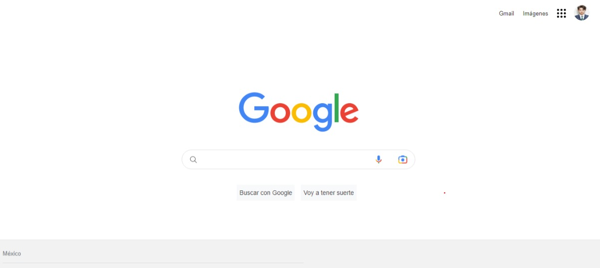

# Clon-google
Proyecto creado en **TecnolochicasPro**, simulando la página principal del navegador de Google
******
Poniendo en practica lo aprendido en el bootcamp logré realizar un clon del explorador de Google
## 1.Intro
Proyecto creado con **HTML y CSS**, se trata del navegador más usado: la interfaz de Google
* Puedes visitar el sitio de el siguiente enlace

**Inspirate de la realización de este proyecto, utiliza tu destreza para demostrar que tu futuro es ser desarrolladora frontend :)**
## Contenido
1. Header:
Esta sección muestra el menú y foto de perfil
2. Main:
Contiene los elementos centrales de el buscador
3. Footer:
Incluye hipervínculos al final de la página

Fue realizado por Ingrid Lilian (✿◠‿◠)
